<!-- _backgroundColor: #1962a7ff -->
<!-- _color: #fff -->

# Nubes, y de puntos

9 de mayo

###### Joan Cano / [Liberam](https://liberam.es) / Máster en TIG Unizar

---

<!-- backgroundColor: white -->
<!-- _class: lead -->

## > whoami

###### Joan Cano

Geógrafo especializado en GIS, Teledetección, láser escáner, fotogrametría y UAV

---

## 2017 - 2023
#### (2017 - 2023) Tecnitop / 3DScanner
Soporte técnico, proyectos relacionados con fotogrametría, láser escáner y drones

#### (2023) Liberam
Operadora de drones, fotogrametría, láser escáner, cartografía

---

# 2017 - 2023
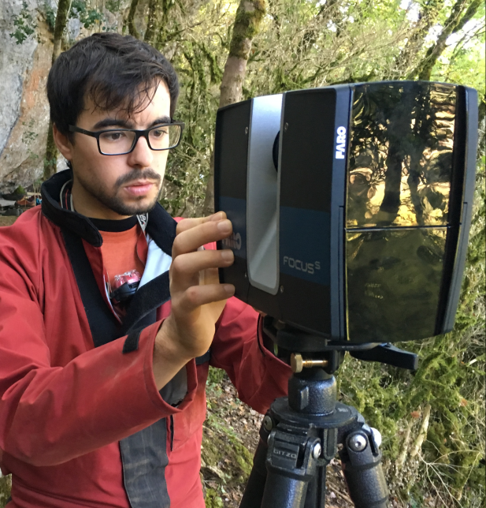

---

### ¿De qué vamos a hablar? 2017 - 2023

<iframe src="diagrams/indice.html" style="height:100%; width: 100%;"></iframe>

---

### ¿De qué vamos a hablar? 2023

<iframe src="diagrams/indice2.html" style="height:100%; width: 100%;"></iframe>

---
# Fotogrametría

----

## De sensores digitales a información espacial

Transformación de imágenes tomadas a mano, por drones o con avioneta en mapas 2D precisos y georreferenciados, modelos 3D, nubes de puntos y análisis.

---
<!-- _backgroundColor: #1962a7ff -->
<!-- _color: #fff -->
# Flujo de trabajo escalable

1. Imágenes o video
2. Procesamiento y creación 2D y modelos 3D
3. Análisis y digitalización
4. Compartir modelos & Colaboración

---
# Inputs
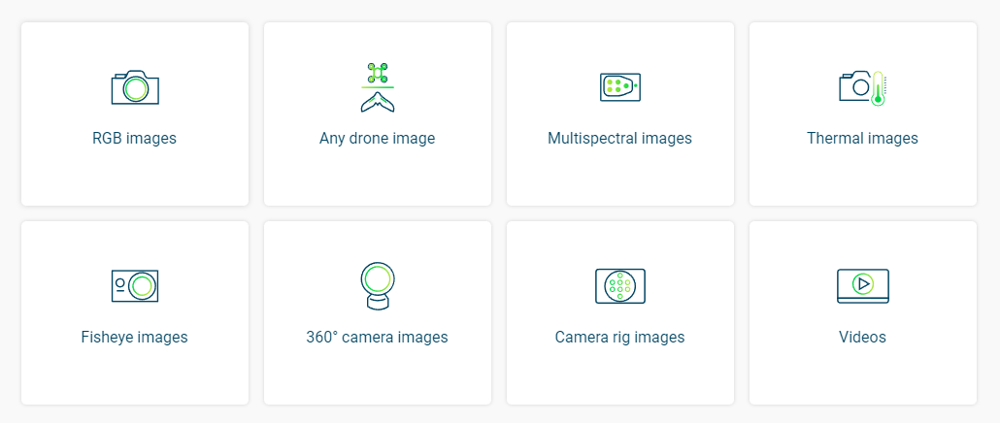

---
# Outputs

---

# Profundicemos: **Fotogrametría** <!--fit -->
- Ciencia que permite realizar mediciones
- Se necesitan imágenes principalmente
- Mediciones y representaciones 2D y 3D
- Creación de activos digitales de muy alta calidad
- Tecnología democrática

---

## **De imágenes a puntos 3D**

Si:
- Podemos identificar lo mismo en **al menos dos imágenes**
- Conocemos los parámetros **externos e internos** de una cámara

Podremos:
- Calcular la posición de un punto en el espacio 3D

---

## **De imágenes a puntos 3D**

- En este ejemplo, la posición de un solo punto en el espacio 3D se calcula con mayor precisión, principalmente porque se han tenido en cuenta más imágenes

---
<i>A tener en cuenta cuando se realiza un vuelo fotogramétrico</i>

### **Solape** Longitudinal / Transversal

- Recubrimiento entre las pasadas de un vuelo, normalmente expresado en porcentaje.
- Finalidad: permitir unir las fotografías mediante estereoscopía.

---
### **Solape** 

---
<!-- _color: #fff -->

### **Solape** 
Más imágenes y más ángulos = Mejor resultado

---

### **Solape** 

---

### **Solape** 

---
## **GSD** (Ground Simple Distance)
<i>distancia entre dos centros de píxeles consecutivos medidos en el suelo. A mayor valor de la imagen, menor será la resolución espacial y los detalles serán menos visibles.</i>

---

El GSD varía con los cambios de terreno

---

---

## Precisión a partir del GSD
[**Cálculo del Ground Simple Distance**](https://support.pix4d.com/hc/en-us/articles/202560249-TOOLS-GSD-calculator)

---

### **GSD**

- **A** = altura o distancia **[metros]**
- **Iw** = ancho de imagen **[pixeles]**
- **Fr** = distancia focal **[millímetros]**
- **Sw** = ancho de sensor **[millímetros]**

---

## **Resolución**
Mayor resolución del sensor: representación más detallada en la imagen

---

---

---

---

---

### La fotogrametría no siempre funciona

- Objetos o superficies sin detalles
- patrones para reconstruir la geometría
- Metales, cristal u objetos transparentes

---

---

---

---
<!-- _class: lead -->
### Hablemos de **precisión**. ¿Para qué se utiliza un dron en topografía/cartografía?

---

---

---

[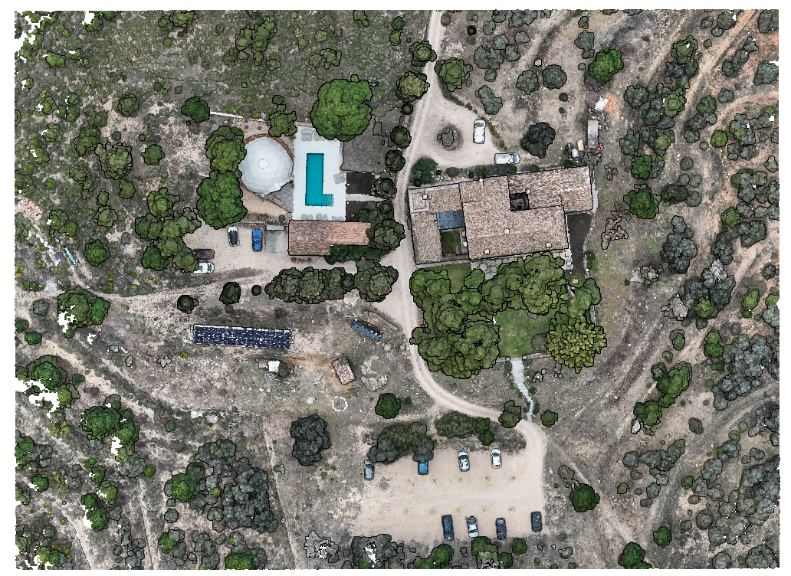](https://liberam.es/dev/pcviewer/masqi.html)
https://liberam.es/dev/pcviewer/masqi.html

---

## **Topografía con drones (sin RTK)**
**Opción 1**
Uso de bases que transmiten datos vía Internet-Móvil. Por ejemplo la **[Red geodésica de Aragón](http://gnss.aragon.es/)**

---

## **Topografía con drones**
**Opción 1**

Solo necesitamos conexión a internet. Se conecta la emisora al servidor y esta recibe las correcciones de mi posición, pudiendo obtener precisiones centimétricas con mi GPS (rover/dron).

[Servicio de Posicionamiento en Tiempo Real - IGN](https://www.ign.es/web/ign/portal/gds-gnss-tiempo-real)

---

## Drones con RTK

---

## **Topografía con drones (sin RTK)**
**Opción 2**

---
## **Topografía con drones (sin RTK)**
### Adquisición de puntos de apoyo

- Los GCPs se miden comúnmente con un receptor GNSS RTK / PPK o una estación total. Nos dan:
  - Posición
  - Orientación
  - Escala
---

## Adquirir puntos GPS de apoyo. **Datos exportados de un GPS RTK**

| **ID** |   **X**    |    **Y**    |  **Z**  |
| :----: | :--------: | :---------: | :-----: |
|   1    | 672462.729 | 4677541.129 | 641.174 |
|   2    | 672476.875 | 4677543.293 | 641.628 |
|   3    | 672474.134 | 4677556.679 | 639.873 |
|   4    | 672497.089 | 4677565.651 | 641.346 |
|   5    | 672524.231 | 4677563.080 | 640.912 |
|   6    | 672534.331 | 4677555.981 | 639.723 |
|   7    | 672519.130 | 4677543.962 | 640.388 |
|   8    | 672508.032 | 4677554.127 | 640.365 |
|   10   | 672473.681 | 4677532.723 | 640.489 |
|   11   | 672480.517 | 4677538.262 | 641.572 |
|   12   | 672488.607 | 4677536.576 | 641.518 |

---
# Adquirir puntos GPS de apoyo. **Toma de datos con GPS RTK**

---
### Puntos GPS de apoyo. **Toma de datos con GPS RTK**

---
### Puntos GPS de apoyo. **Colocar GCP en campo**

---
# Puntos GPS de apoyo. **Toma de datos con GPS RTK**

https://youtu.be/4tm3bJcf_wk
https://youtu.be/BwAx5-Wqd_A

---

#### Monitorización de los recursos hidrológicos nivales: [el glaciar de Monte Perdido](https://www.youtube.com/watch?v=LmFXOKf-TKE) (Huesca)

---

# [Seguimiento de la erupción](https://datos-lapalma.opendata.arcgis.com/)

[Proyecto QGIS](https://drive.google.com/file/d/1D2aBwB3IKoYT-drgazqQVGmx-X64JZdq/view?usp=sharing)

[13/10](https://datos-lapalma.opendata.arcgis.com/maps/d1a80de876b14f188cece8da90fc54f0/explore)
[18/10](https://datos-lapalma.opendata.arcgis.com/maps/d1a80de876b14f188cece8da90fc54f0/explore)

---

# Software
<iframe src="diagrams/software.html" style="height:100%; width:100%;"></iframe>

---
<!-- _class: lead -->
<!-- _backgroundColor: #1962a7ff -->
<!-- _color: #fff -->

# Procesamiento fotogramétrico - Pix4D

---
<!-- _class: lead -->
<!-- _backgroundColor: #1962a7ff -->
<!-- _color: #fff -->

# Procesamiento fotogramétrico - Agisoft Metashape

---
# Láser escáner
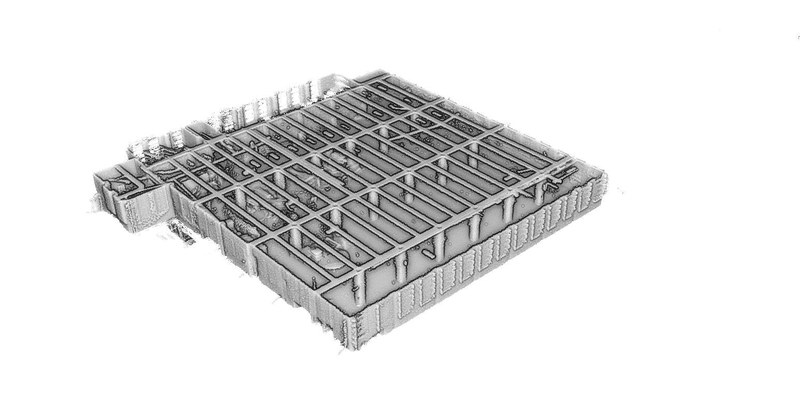

Instrumentos para analizar un objeto o entorno físico para reunir datos tanto de su geometría como de su radiometría (forma y color).
	
Los resultados de la toma de datos son nubes de puntos, que contienen información x, y, z y rgb.

---

### **Tipologías de captura masiva de datos**

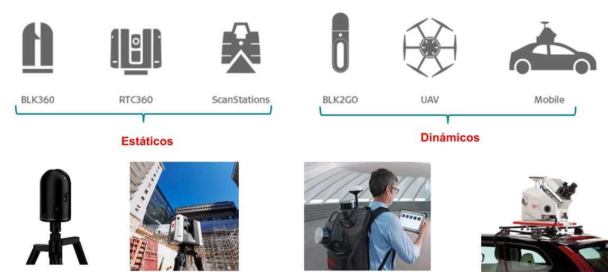

---
## **Toma de datos**
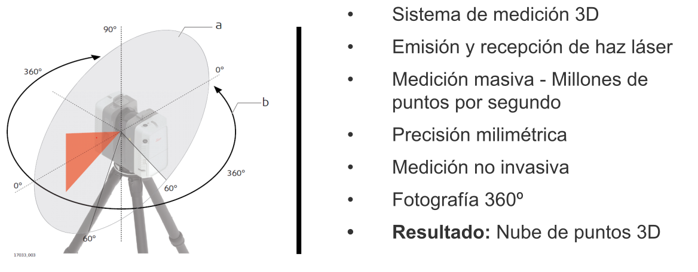

--- 

## **Registro**
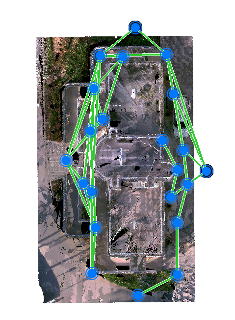

---
<!-- _class: lead -->
<!-- _backgroundColor: #1962a7ff -->
<!-- _color: #fff -->

# Procesamiento con Register360

---
<!-- _class: lead -->
# **Procesamiento datos LIDAR con DJI Terra - Matrice 300 RTK**

---
# **Datos LIDAR - Elios 3**
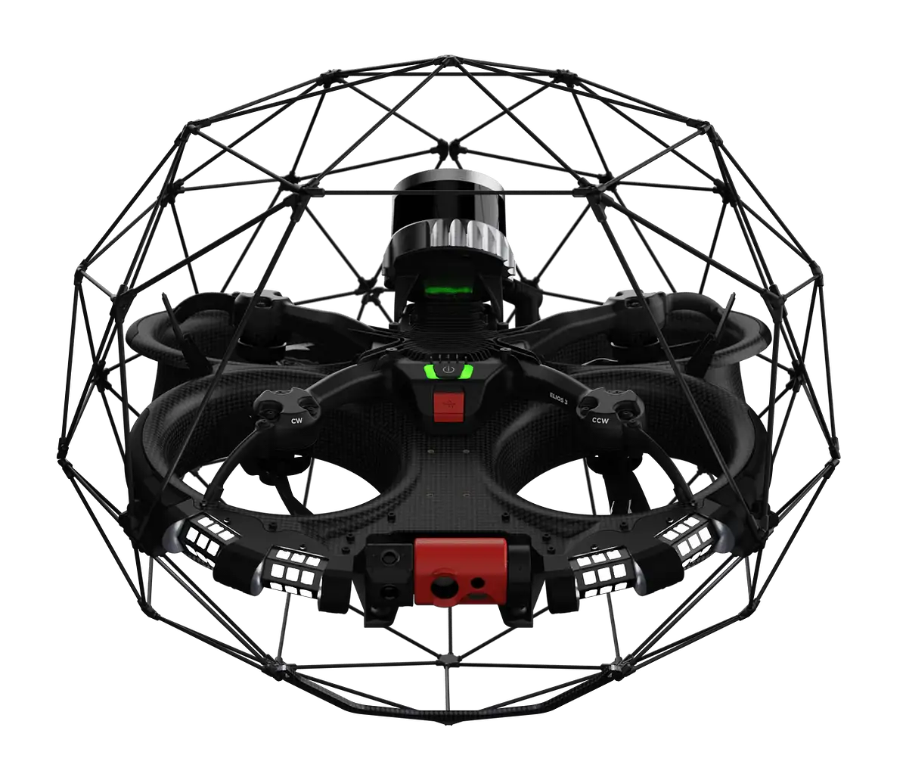

---

---

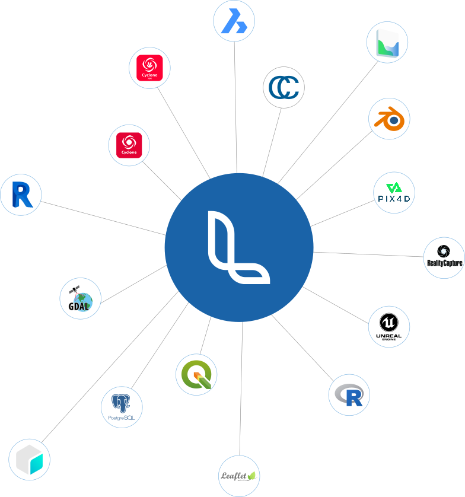

---

<iframe src="https://inteligenciaclimatica.es/" style="height:100%; width: 100%;"></iframe>

---

# **Operadora de drones**
- Categoría abierta A1/A2/A3
- Categoría específica STS-ES-01 / STS-ES-02
- Radiofonista
- Inspecciones en interiores

---

<!-- _class: lead -->
# Proyectos, software y experiencias

---
<!-- _backgroundColor: #121212 -->

# **La Torronera**
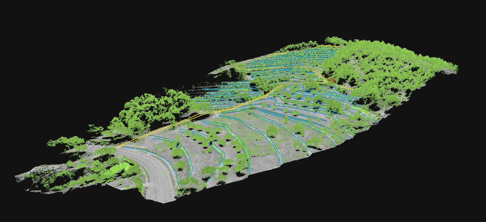

---

# Bella Orxeta

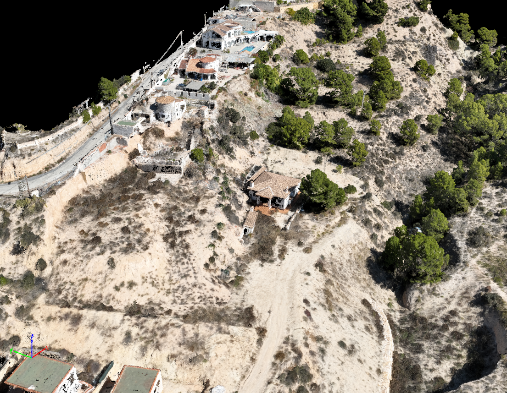
Datos disponibles -> http://gofile.me/70z3P/Dwj0e27Hl

---

# Toma de nube de puntos con E3
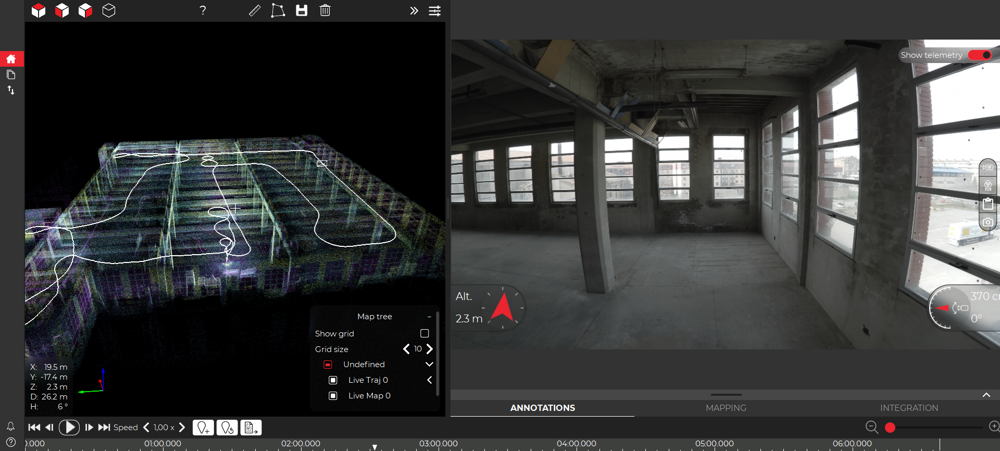

---

# Control espigón del super puerto de Bilbao
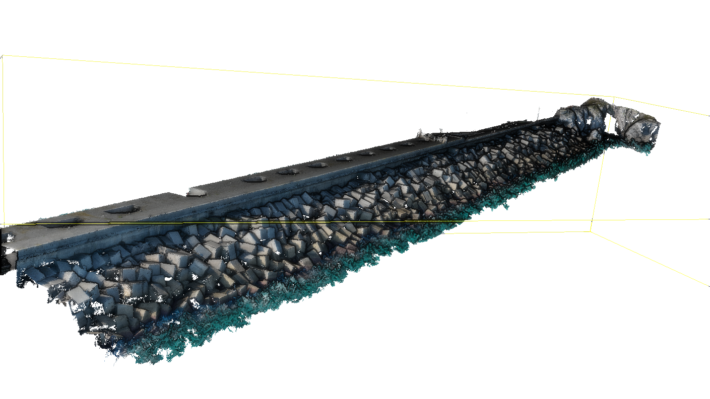

---
<!-- _color: #fff -->

# MasQI

---
<!-- _color: #fff -->

# MasQI

---

# Delineación C. de golf

---

# **Delineación C. de golf**

---
<!-- _color: #fff -->
<!-- _backgroundColor: #1e68a0 -->

# Vuelo en zona urbana para gemelo digital

---
<!-- _color: #fff -->

# Vuelo en zona urbana para gemelo digital

---
# Vuelos para redacción de proyecto A4

<iframe src="assets/vuelos_a4/index.html" style="height:100%; width: 100%;"></iframe>

---

# Vuelos para redacción de proyecto A4

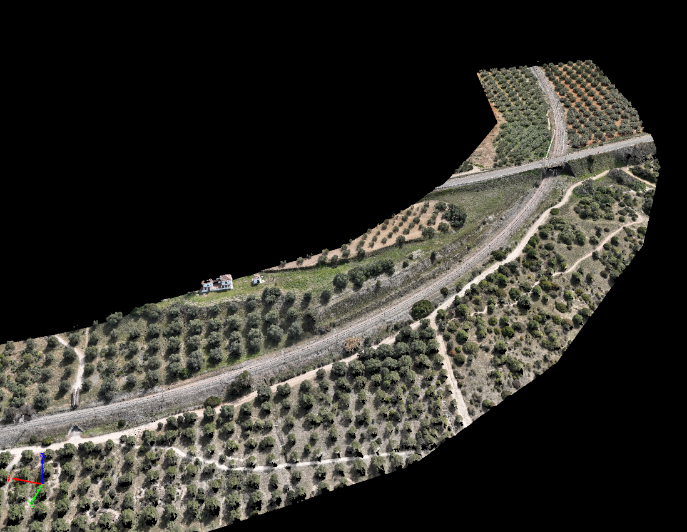

---

# Vuelos para redacción de proyecto A4
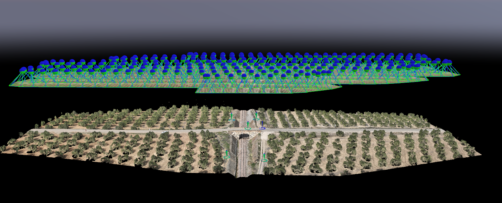

---

# Vuelos para redacción de proyecto A4
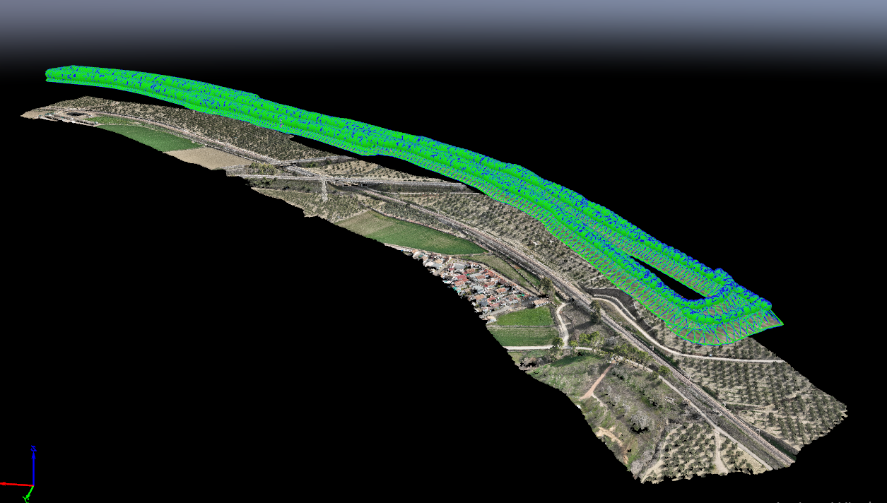

---

<!-- _color: #fff -->

# Topografía 3D para escalada

---

# Servicios de cartografía web
- Librerías webmapping
- Bases de datos
- Servicios OGC
- Docker

---
<!-- _backgroundColor: #1e68a0 -->
<!-- _color: #fff -->

# Gracias!

##  / joan@liberam.es
##  / liberam-technologies
##  / _liberam

---

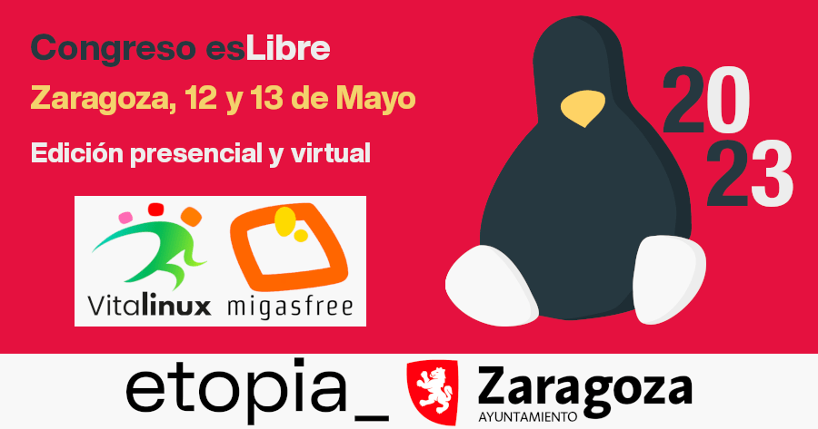

