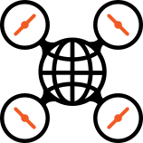
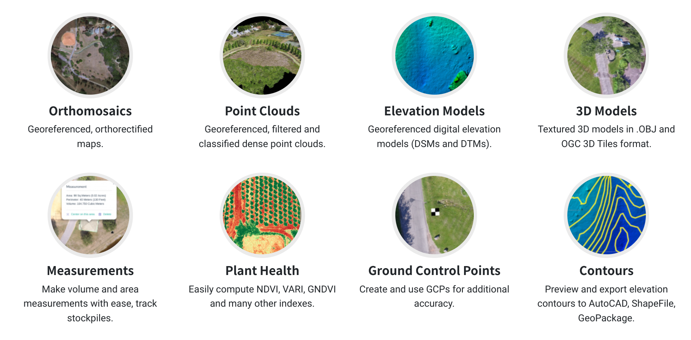
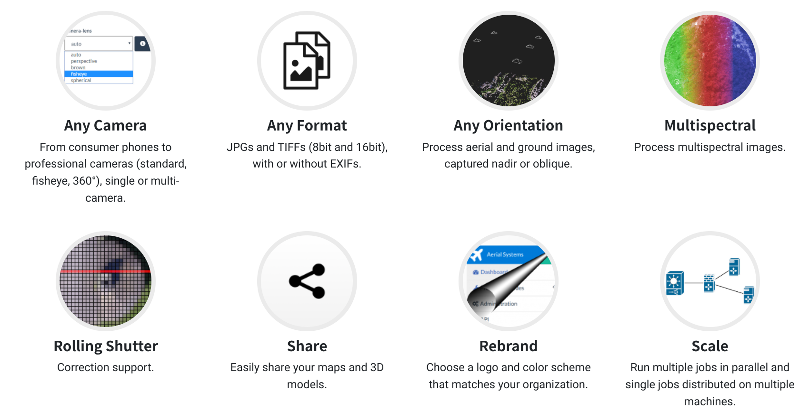
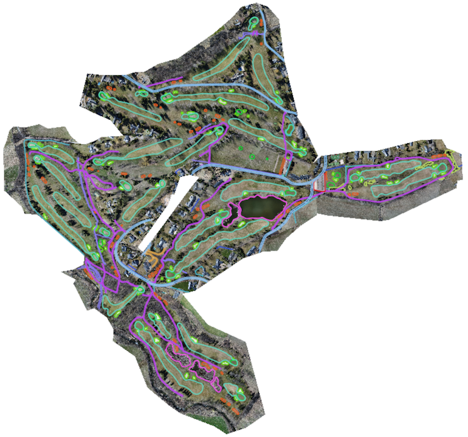
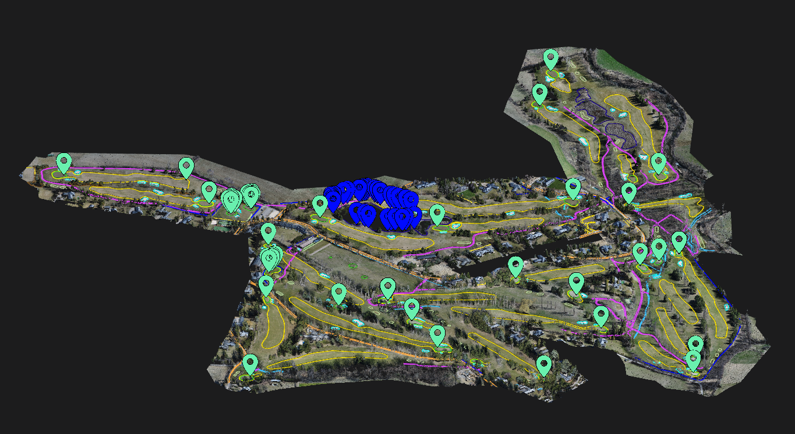
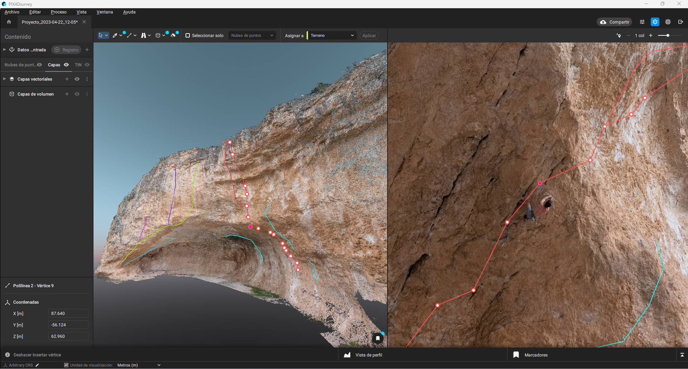
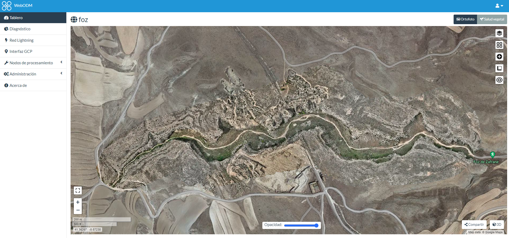
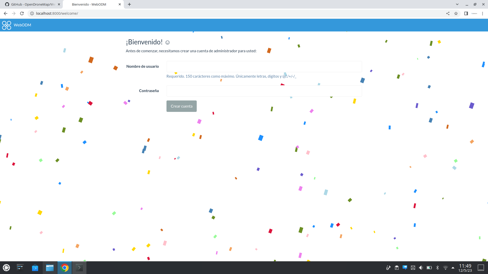
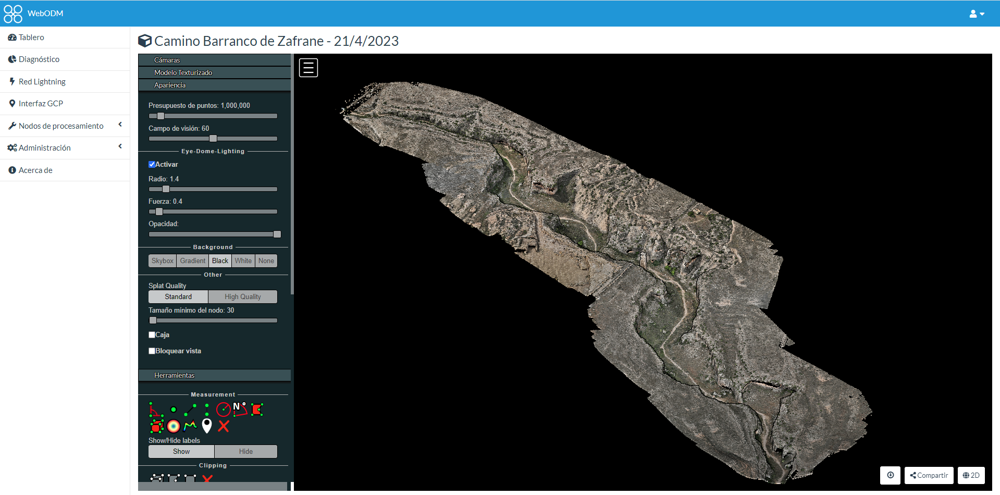
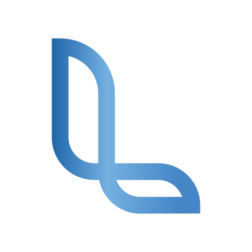

<!-- _backgroundColor: #1962a7ff -->
<!-- _color: #fff -->
<style>
  img[alt~='center'] {
    display: block;
    margin-left: auto;
    margin-right: auto;
  }

</style>

# El uso de OpenDroneMap en proyectos de fotogrametría aérea con drones



13 de mayo

###### Joan Cano / [Liberam](https://liberam.es) / esLibre


---

<!-- backgroundColor: white -->
<!-- _class: lead -->

## > whoami

###### Joan Cano
<p style="color: grey; font-size: 0.8em;">Geógrafo especializado en GIS, Teledetección, láser escáner, fotogrametría y UAV</p>


---

# **OpenDroneMap** 

Herramientas de línea de comandos de código abierto para procesar **imágenes aéreas de drones**. 

**ODM** convierte imágenes en:
- Nubes de puntos clasificadas
- Modelos 3D texturizados
- Imágenes ortorrectificadas georreferenciadas
- Modelos digitales de elevación georreferenciados

---



---



---

# Fotogrametría


---

## De sensores digitales a información espacial

Transformación de imágenes tomadas a mano, por drones o con avioneta en mapas 2D precisos y georreferenciados, modelos 3D, nubes de puntos y análisis.


---
<!-- _color: #fff -->


---
<!-- _color: #fff -->


---



---



---
<!-- _color: #fff -->



---

# **Instalación** 

## Docker 

```
# Windows
docker run -ti --rm -v c:/Users/youruser/datasets:/datasets opendronemap/odm --project-path /NameProjectsFolder/images nameProject
```

```
# Mac/Linux
docker run -ti --rm -v /home/youruser/datasets:/datasets opendronemap/odm --project-path /NameProjectsFolder/images nameProject
```

---

#### **Agregar parámetros adicionales al proceso**

```
docker run -ti --rm -v  /home/youruser/datasets:/datasets opendronemap/odm --project-path /NameProjectsFolder nameProject [--additional --parameters --here]
```
<br>

**Ejemplo:** generar un DSM (--dsm) y aumentar la resolución de la ortofoto (--orthophoto-solution 2):

```
docker run -ti --rm -v  /home/youruser/datasets:/datasets opendronemap/odm --project-path /NameProjectFolder nameProject --dsm --orthophoto-resolution 2
```

---

# WebODM



---
# Uso de WebODM

Instalación

```
sudo apt install docker-compose
sudo apt install python-pip
git clone https://github.com/OpenDroneMap/WebODM --config core.autocrlf=input --depth 1
cd WebODM 
sudo ./webodm.sh start --media-dir /home/user/webodm_data
```

Acceder a webodm: http://localhost:8000

---


---


---



---

## Drones con RTK


---

## **Topografía con drones (sin RTK)**
**Opción 2**


---

## Informes
<iframe src="../assets/img_presentacion/odm/report.pdf" width="100%" height="600px"></iframe>

---

## Comparemos

<iframe width="560" height="315" src="../assets/img_presentacion/odm/comparativa/orto_1.mp4" frameborder="0" allowfullscreen></iframe>

---

## Comparemos

<iframe width="560" height="315" src="../assets/img_presentacion/odm/comparativa/orto_2.mp4" frameborder="0" allowfullscreen></iframe>

---

## Comparemos

<iframe width="560" height="315" src="../assets/img_presentacion/odm/comparativa/pc_1.mp4" frameborder="0" allowfullscreen></iframe>

---


## Comparemos

<iframe width="560" height="315" src="../assets/img_presentacion/odm/comparativa/pc_2.mp4" frameborder="0" allowfullscreen></iframe>

---
<!-- _backgroundColor: #1e68a0 -->
<!-- _color: #fff -->

# Gracias!


##  / joan@liberam.es
##  / liberam-technologies
##  / _liberam
