<!-- _backgroundColor: #1760a5 -->
<!-- _color: #fff -->

# Liberam

#### **Unimos tecnología y geografía**

---
<!-- backgroundColor: white -->
<!-- _class: lead -->

## **Liberam Technologies**

Somos una empresa que ofrece servicios relacionados con la geomática, especializada en fotogrametría aérea y terrestre, drones, láser escáner, GIS y teledetección.

--- 

# **Servicios aplicados al olivar** 

*a finales de los 70 compró una vibradora americana Omi, importada por Santana. Una de las primeras que se veían en la comarca. «En California ya las usaban desde hacía tiempo. Todo el mundo decía que no funcionaría, que dañaría las olivas. Pero funcionó ... Hoy todo el mundo las usa, y se ven como algo normal.* [^1]

---
### **Planificación de la plantación**
Identificar las áreas más adecuadas para la plantación de diferentes cultivos. Evaluando aspectos como el drenaje del suelo, la exposición al sol y la pendiente del terreno, lo que ayuda a tomar decisiones fundamentadas sobre qué cultivos son más apropiados para cada zona.

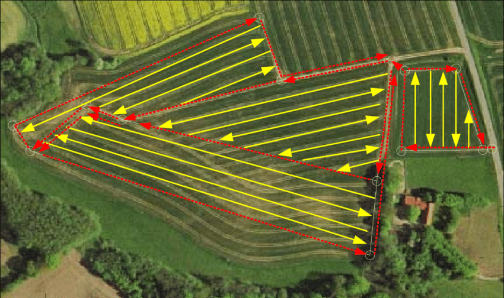

---

### **Diseño de sistemas de riego eficientes**
Comprender la distribución del agua en el terreno permite optimizar la irrigación y minimizar el desperdicio de recursos hídricos mediante modelos de elevación y mapas de pendientes.

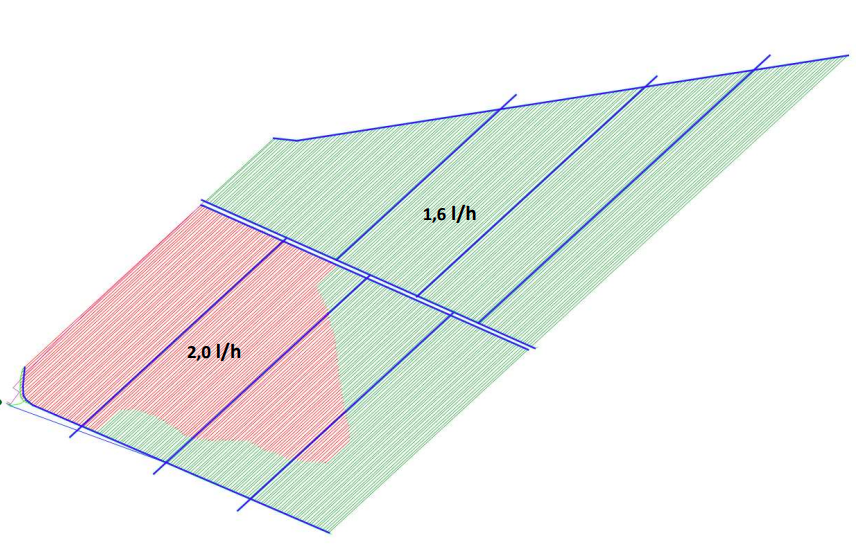

---

### **Detección de malas hierbas**
Aplicación de tratamientos herbicidas focalizado dejando zonas sin malas hierbas de la parcela sin tratar

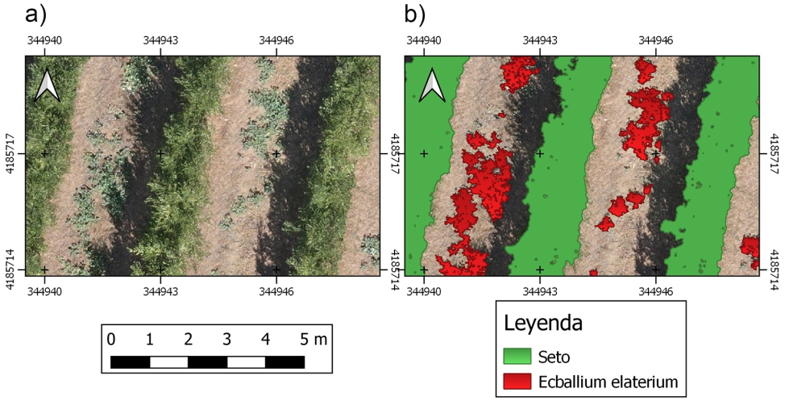

---

### **Control de la erosión**
Identificar áreas propensas a la erosión y la escorrentía. Al conocer estas zonas vulnerables, se pueden implementar medidas de conservación del suelo, como terrazas o barreras naturales, para prevenir la pérdida de tierra fértil y mantener la salud del suelo.

---
### **Detección de zonas con problemas de drenaje**
Identificar áreas mal drenadas, que pueden afectar negativamente el desarrollo de los cultivos. Al eliminar los problemas de drenaje se mejora la aireación del suelo y se reduce el riesgo de encharcamiento, lo que favorece el crecimiento saludable de las plantas.

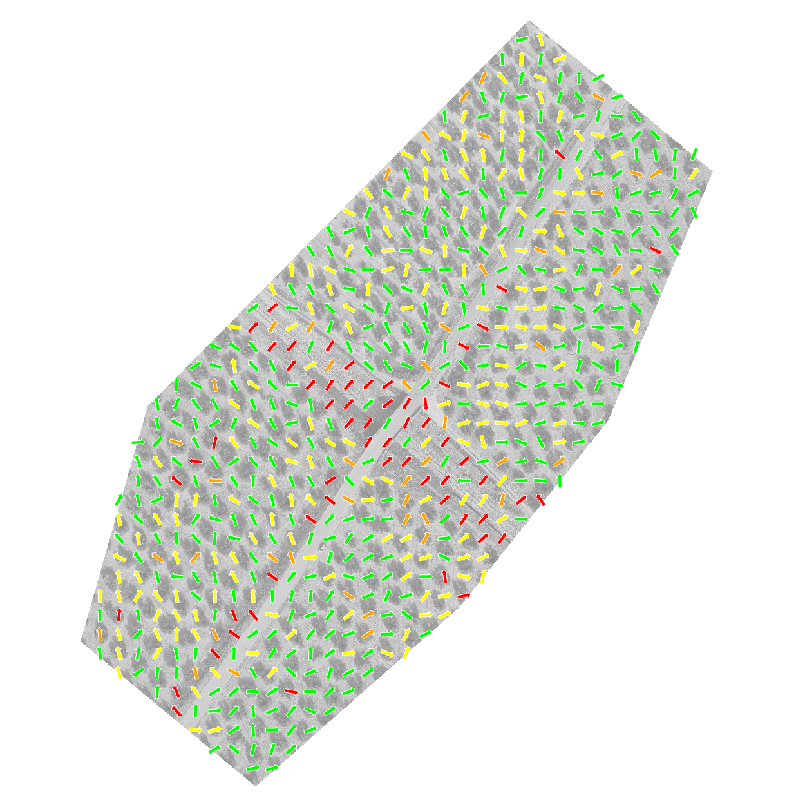

---
### **Control de la contaminación agrícola**
Al conocer la topografía del terreno, los agricultores pueden identificar áreas con mayor riesgo de contaminación, como la acumulación de productos químicos o fertilizantes en ciertas zonas. Esto permite implementar prácticas agrícolas más sostenibles y reducir el impacto ambiental.

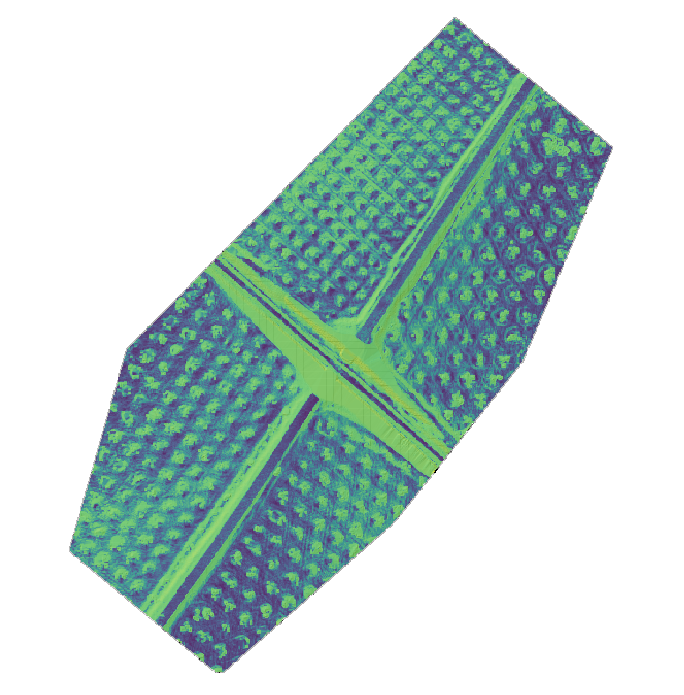

---

### **Monitoreo detallado de cultivos**
Con drones se consigue proporcionar una visión detallada y actualizada de los cultivos. Esto permite  identificar de manera temprana signos de estrés, enfermedades, plagas o deficiencias nutricionales en los cultivo.

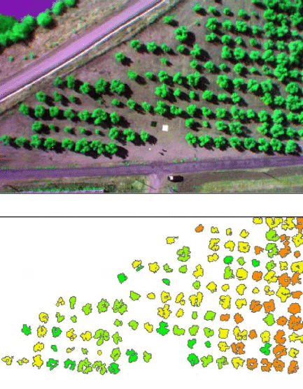

---

### **Detección de estrés hídrico** 
El cual induce el cierre de estomas en el olivar, lo que lleva a un menor enfriamiento de las hojas por transpiración que provoca una subida de la temperatura de la copa del olivo. Esto permite implementar estrategias de riego focalizado, reduciendo el consumo de agua y maximizando su eficiencia.

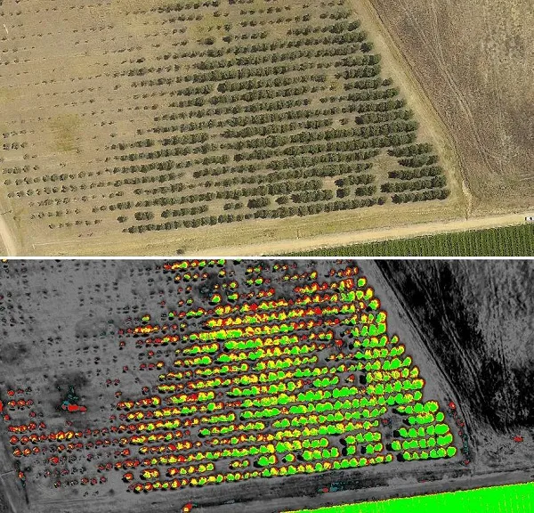

---

### **Conteo e inventariado de árboles** 
Para tasar, valorar o vender una finca o si es necesario justificar subvenciones por árbol.

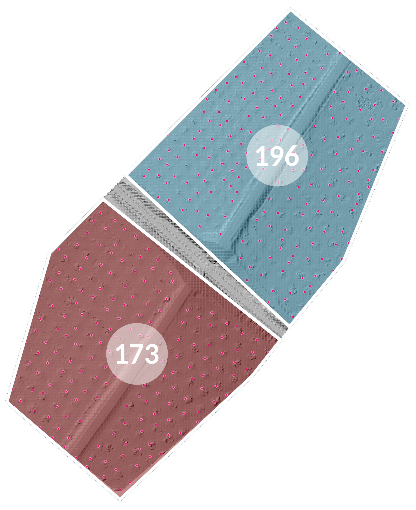

---

### **Mapeo de cultivos con precisión**
 Los drones pueden realizar vuelos precisos y repetitivos sobre el terreno, generando mapas detallados de la salud y desarrollo de los cultivos en diferentes etapas de crecimiento, incluso parámetros geométricos tales como altura, área proyectada y volumen de la copa. Esto puede ayudar a optimizar las prácticas agrícolas, como la aplicación diferencial de fertilizantes y pesticidas.

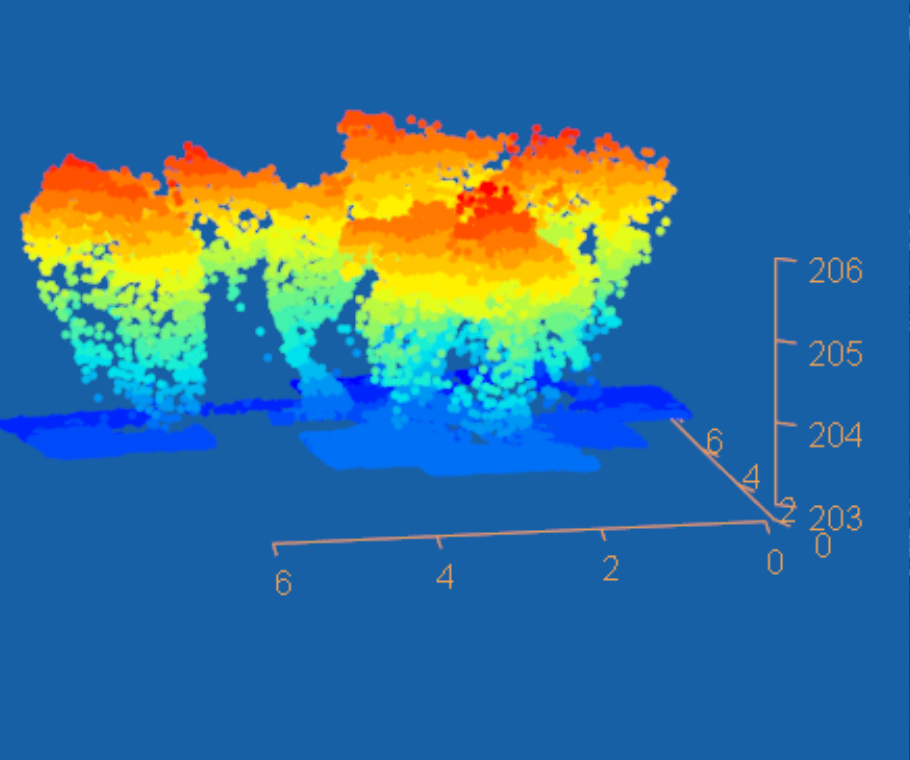

---

### **Inspección de infraestructuras agrícolas**
Además de monitorear los cultivos, los drones pueden inspeccionar infraestructuras agrícolas, como cercas, sistemas de riego, invernaderos y paneles solares.

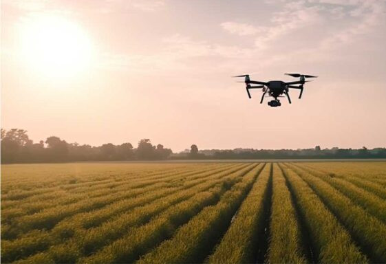

---

### **Evaluación de daños en grandes áreas**
En caso de desastres naturales, como incendios forestales o inundaciones, los drones pueden sobrevolar grandes áreas de manera rápida y segura para evaluar los daños y la extensión del impacto en los cultivos. 

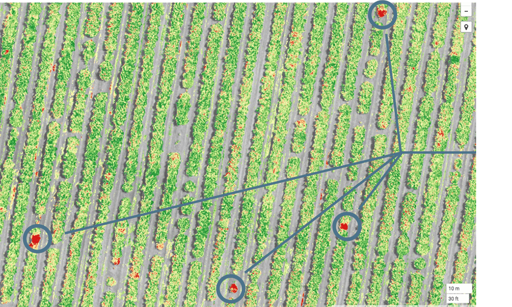

---
### **Acceso a zonas inaccesibles**
En terrenos difíciles de acceder o peligrosos para los operadores, los drones pueden proporcionar información y datos sin poner en riesgo la seguridad humana. Esto es especialmente valioso en áreas montañosas o de difícil acceso.
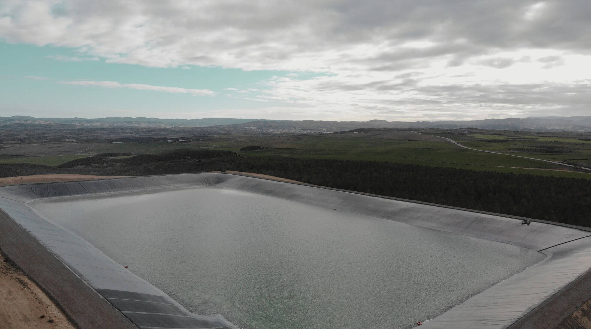

---
### **Replantear datos de un plano en el campo y viceversa**
La topografía permite llevar la información de un plano de la propiedad o terreno a la realidad del campo, estableciendo puntos de referencia y marcadores para guiar la implementación de infraestructuras agrícolas, sistemas de riego y otras mejoras planificadas.
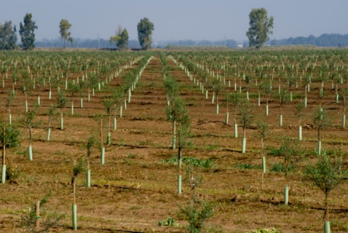

---

### **Localizar y marcar los límites de una propiedad**
La topografía es fundamental para determinar y establecer con precisión los límites de una propiedad agrícola. Esto evita disputas de propiedad y asegura que se utilice el espacio adecuado para la agricultura.

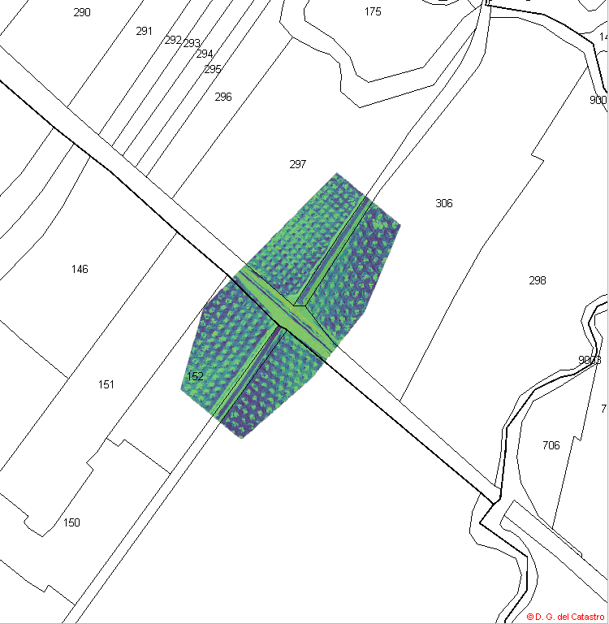

---

### **Medir el área de parcelas y propiedades**
Al utilizar técnicas topográficas, los agricultores pueden medir de manera precisa el área total de su propiedad. Esta información es esencial para planificar la distribución de los cultivos y recursos de manera óptima.

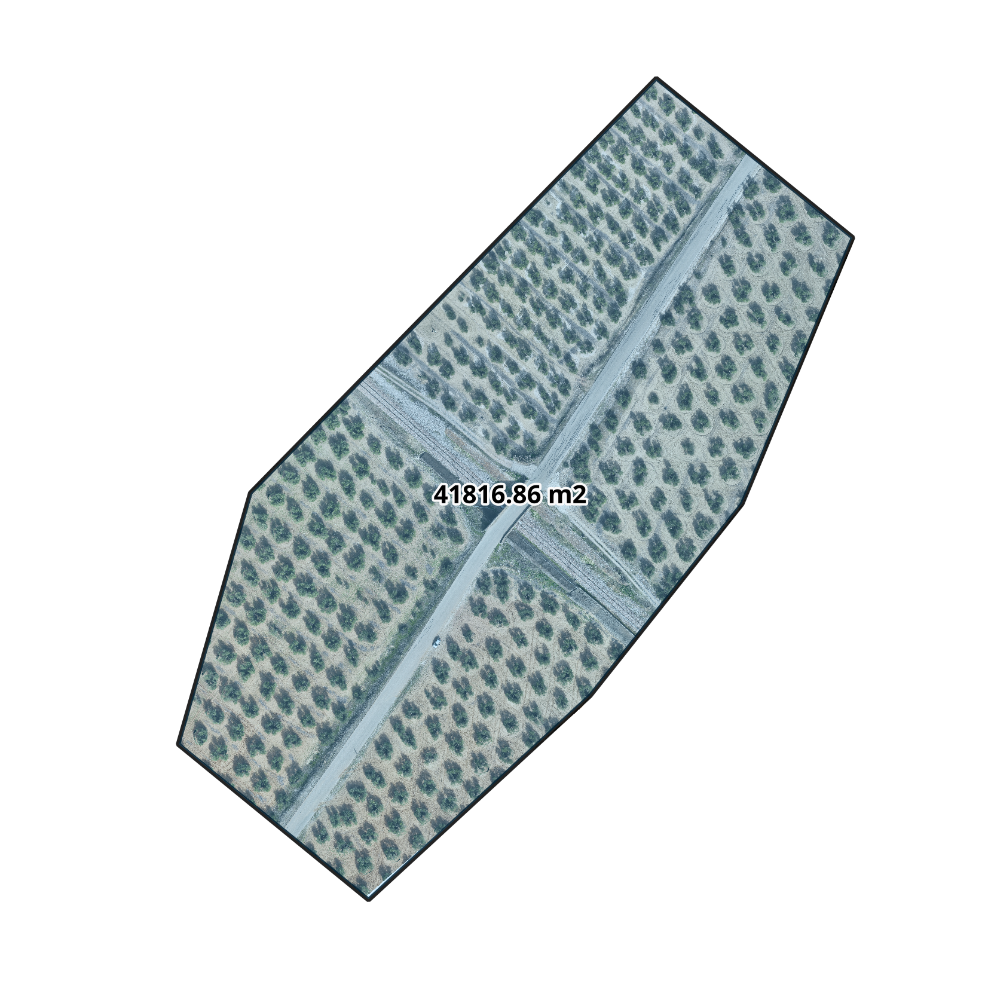

---

### **Subdividir terrenos en parcelas**
La topografía facilita la subdivisión del terreno en parcelas más pequeñas, lo que puede ser útil para la planificación de cultivos específicos o para la venta o arrendamiento de áreas específicas.
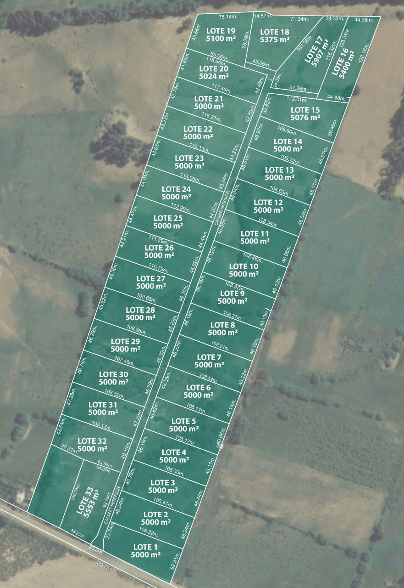

---
<!-- _backgroundColor: #1e68a0 -->
<!-- _color: #fff -->

# Contacto

##  / joan@liberam.es
##  / [liberam-technologies](https://www.linkedin.com/company/liberam-technologies)
##  / [_liberam](https://www.instagram.com/_liberam/)

---

[^1]: https://www.ideal.es/jaen/jaen/201610/01/olivar-afronta-segunda-revolucion-20160930193851.html?ref=https%3A%2F%2Fwww.ideal.es%2Fjaen%2Fjaen%2F201610%2F01%2Folivar-afronta-segunda-revolucion-20160930193851.html

